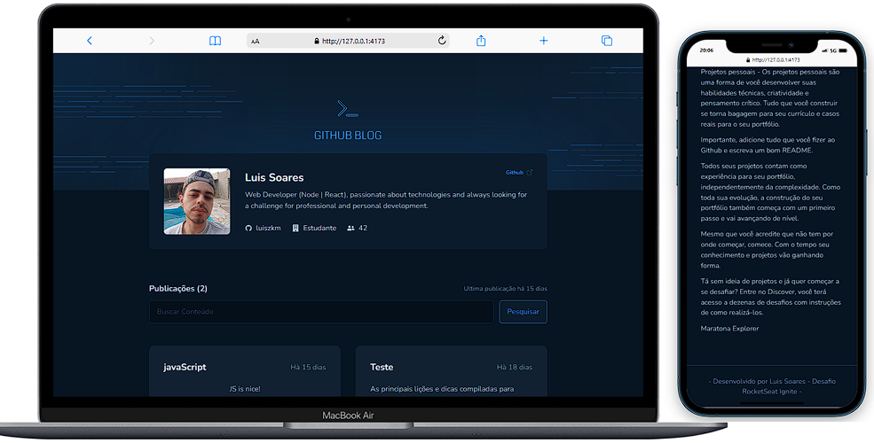

# Github Blog
Projeto para consumir a API do github ( GitHub Users API , GitHub Search API, GitHub Issues API)

## funcionalidades

- Listagem do perfil , imagem, número de seguidores, nome e outras informações disponíveis pela API do GitHub.)
- Listar e filtrar todas as issues do repositório com um pequeno resumo do conteúdo dela
- Criar uma página para exibir um post (issue) completo

[](https://app.netlify.com/sites/bespoke-wisp-0a6461/deploys)

## Stack utilizada

**Front-end:** React | TypeScript | TailwindCSS | react-hook-form | react-router-dom | axios

**Layout:** Figma

[](https://www.figma.com/file/iHwJw0TcFK2dryb7xdTzbU/GitHub-Blog-(Community)?node-id=0%3A1&t=VdnfoRX7a9ii3V9T-0)





## Instalação

Instale my-project com npm

```bash
# Clone este repositório
$ git clone <https://github.com/luiszkm/GitHubBlog.git>

# Instale as dependências
$ npm install

# Execute a aplicação em modo de desenvolvimento
$ npm run dev

```
    
## Licença

[MIT](https://choosealicense.com/licenses/mit/)


## Apêndice

Feito com :heart: e dedicação por mim :rocket:

[](https://www.linkedin.com/in/luis-soares-64b0a6227/)


